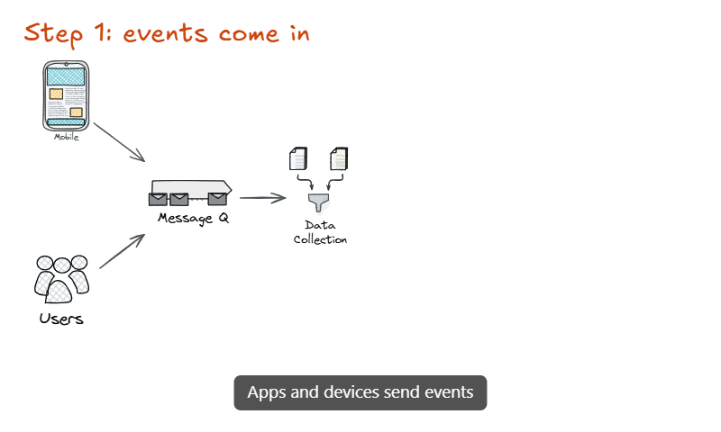
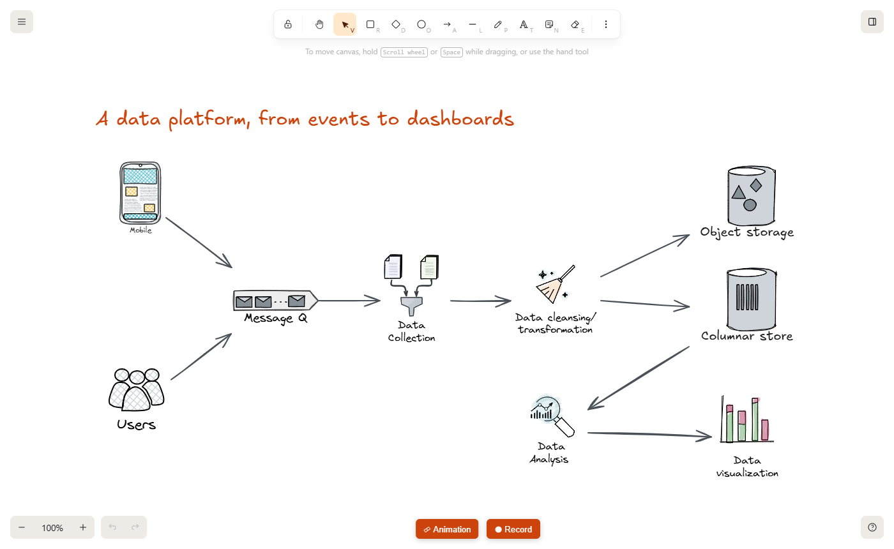
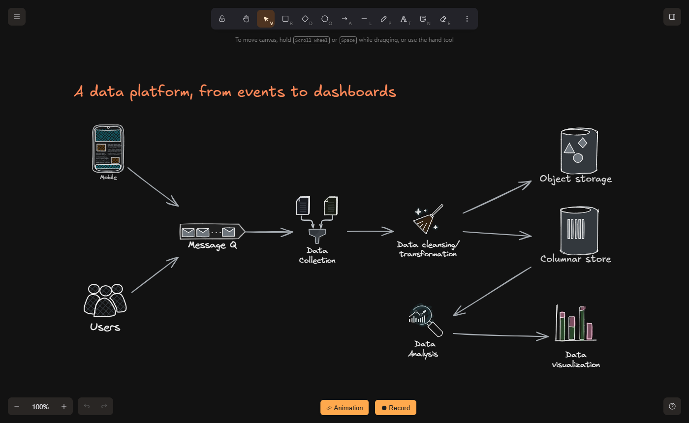
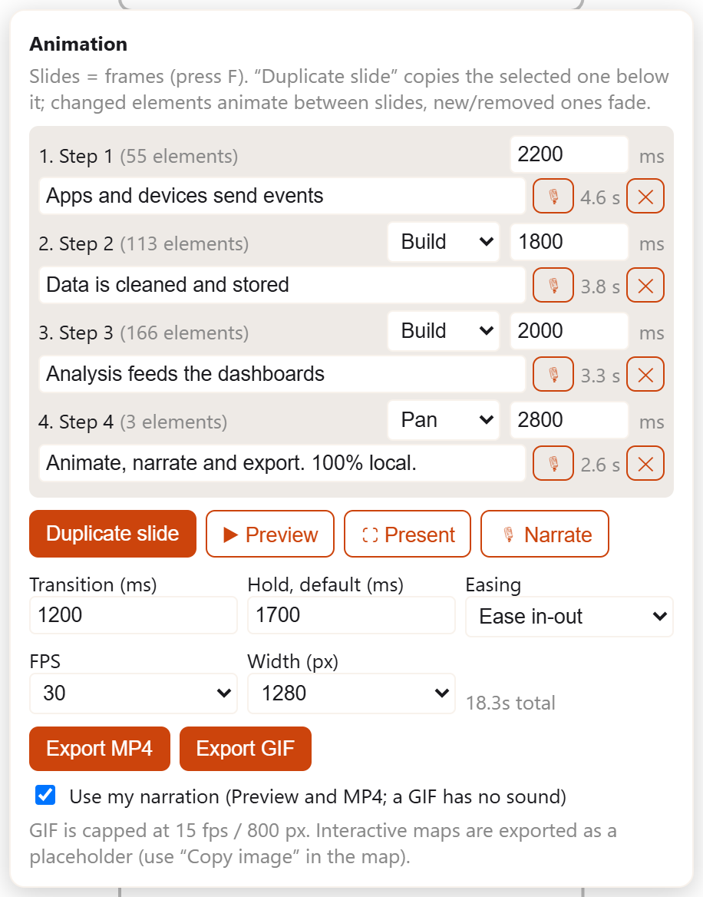
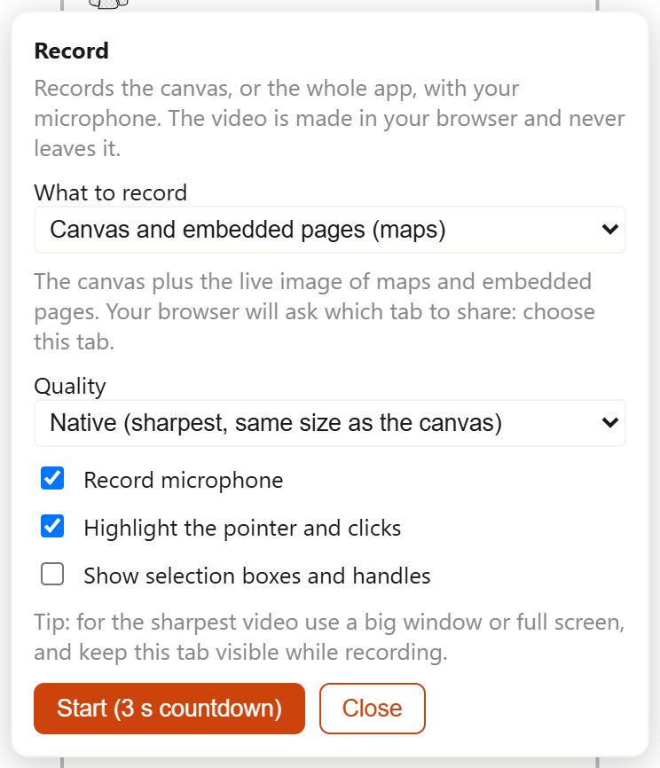
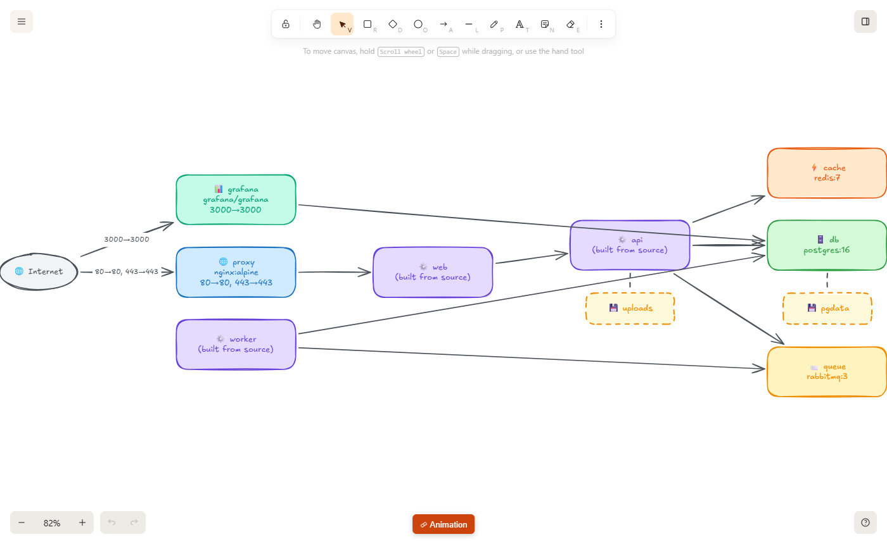
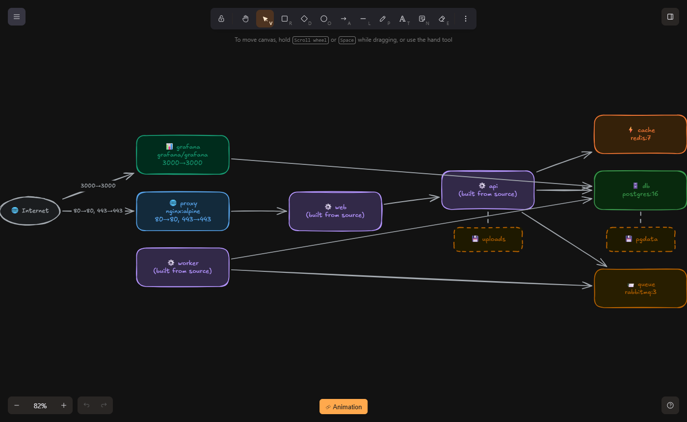
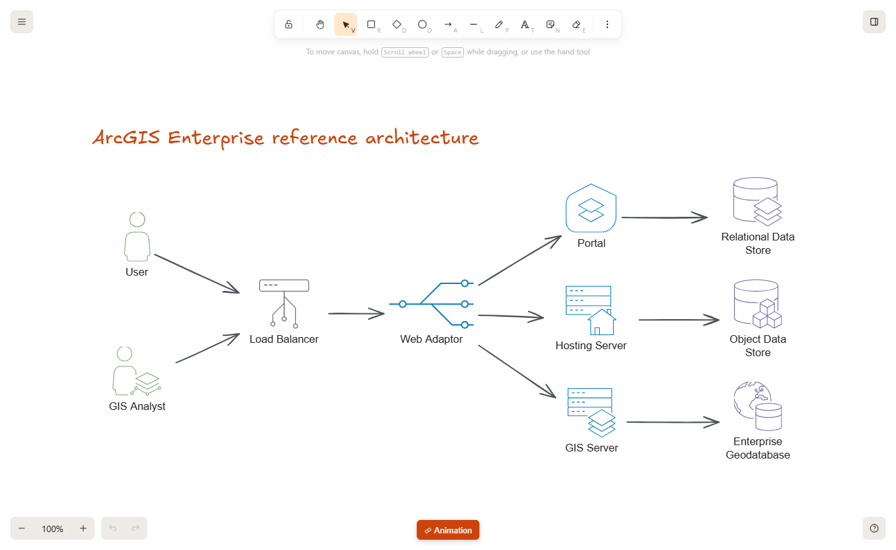
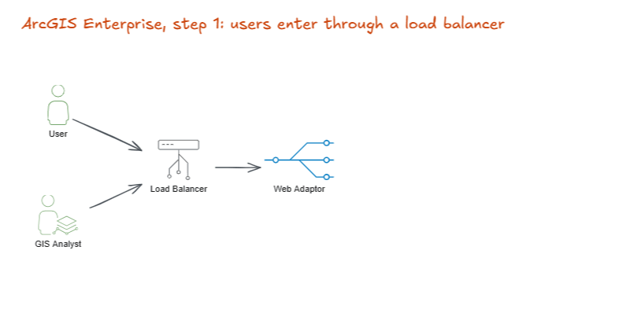

<div align="center">

# Trazo

**Hand-drawn diagrams that move.** A local-first diagram studio: animate your slides into MP4 or GIF, generate diagrams with your own LLM, and keep everything on your machine. No telemetry.



<sub>Made and exported to GIF with Trazo itself: new elements appear one by one, arrows draw themselves, captions fade in and the camera travels to the last slide. Elements that do not change stay perfectly still.</sub>

_Built on [Excalidraw](https://github.com/excalidraw/excalidraw) (MIT). Not affiliated with or endorsed by Excalidraw or Esri._

[English](#english) · [Español](#español)

</div>

---

## English

### Why Trazo?

Excalidraw is a great hand-drawn whiteboard. Trazo keeps everything that makes it great and adds what technical teams keep asking for:

|  |  |
| --- | --- |
| 🎞️ **Diagrams that move** | Frames are slides. Duplicate a slide, change things, and elements **animate between slides** (position, size, colour, opacity…). You can **narrate it with your voice**: talk while it builds, press → for the next slide, and the MP4 keeps voice and picture in sync. Each slide has its own timing, transition (smart, fade, cut, **build** where elements appear one by one and arrows draw themselves, or **pan** where the camera travels over the canvas) and caption, and unchanged elements stay still. Preview, present with ← →, and **export MP4 or GIF**, rendered in your browser, nothing uploaded. |
| 🤖 **Bring your own LLM** | "Text to diagram" connects to **your** model: Ollama / LM Studio locally, **Ollama Cloud**, any OpenAI-compatible server, or Anthropic. Off by default; nothing is sent until you configure it. Output is a Mermaid diagram turned into editable shapes, colored by role with symbols (see [docs/AI.md](docs/AI.md#styling-diagrams-colors-symbols)). |
| 🎙️ **Record while you explain** | **⏺ Record** captures just the canvas, the canvas with live maps, or the whole app, with your microphone and a highlighted pointer, and gives you an MP4 or WebM. Made in your browser, nothing uploaded (see [docs/RECORDER.md](docs/RECORDER.md)). |
| 🏗️ **Infrastructure to diagram** | Paste a `docker-compose.yml` and get the architecture drawn for you: services by role, published ports, dependencies and volumes. Read in your browser, **no AI and no network**, so the same file always gives the same diagram (see [docs/INFRA.md](docs/INFRA.md)). |
| 🔒 **Local-first and hardened** | No analytics, no Sentry, no CDN, no service worker, no hosted collaboration. Strict Content-Security-Policy, read-only containers, ports bound to `127.0.0.1`. One `docker compose` and it runs on your machine. See [docs/SECURITY.md](docs/SECURITY.md), and verify it yourself. |
| 🧩 **Icon packs by source** | 450+ components grouped **by source**, never mixed, each credited to its author: architecture and system design, data processing, deep learning, networking, UML/ER, Microsoft Fabric… from 16 curated **community libraries** (downloaded from the official catalog at build time), plus the **GIS pack** below. |
| 🗺️ **GIS pack: live maps and Esri icons** | Embed interactive ArcGIS maps in the canvas: add layers by URL or item ID, browse _My content_ or search any portal, open Web Maps, sketch on top. Works with **ArcGIS Online and any number of ArcGIS Enterprise portals** at once. Official **Esri Architecture Center** icons and Utility Network concepts. Optional Utility Network trace (needs a Web Map with a Utility Network). |

<table>
<tr>
<td><br><sub><b>Light mode</b>: a data platform from events to dashboards</sub></td>
<td><br><sub><b>Dark mode</b>: same drawing, theme-aware UI</sub></td>
</tr>
<tr>
<td><br><sub><b>Text to diagram</b> with your own LLM: colors, symbols and groups</sub></td>
<td><br><sub><b>Library</b> grouped by source, never mixed</sub></td>
</tr>
<tr>
<td><br><sub><b>Animate and narrate</b>: a transition, a caption and your own voice for each slide</sub></td>
<td><br><sub><b>Record</b>: the canvas, the canvas with live maps, or the whole app, with your microphone</sub></td>
</tr>
<tr>
<td><br><sub><b>Infrastructure to diagram</b>: a docker-compose file, drawn for you</sub></td>
<td><br><sub>Same diagram in dark mode: offline, no AI</sub></td>
</tr>
<tr>
<td><br><sub><b>GIS pack</b>: a live map inside the canvas (ArcGIS Online or any Enterprise portal)</sub></td>
<td><br><sub><b>GIS pack</b>: an ArcGIS Enterprise architecture with official Esri icons</sub></td>
</tr>
</table>

<details>
<summary>See the GIS pack animated</summary>



</details>

### Quick start

Requirements: **Docker** (with Compose v2) and **Node.js 20+** (only to generate the icon library).

```bash
git clone https://github.com/balalex12/trazo.git && cd trazo

node tools/build-library.js      # downloads the Calcite glyphs, builds the ArcGIS library
docker compose up -d --build     # first build takes a few minutes

# open http://localhost:3000
```

Stop with `docker compose down`. Everything listens on `127.0.0.1` only.

### What talks to the network?

| When | Contacts | Why |
| --- | --- | --- |
| Opening the app, drawing, saving, animating, exporting | **nothing** | fully local (verified: 0 external hosts, 0 CSP violations, 0 service workers) |
| You use an interactive map | `js.arcgis.com`, Esri basemaps, **the portals you add** | an ArcGIS map needs them |
| You configure an LLM | **the URL you set** (e.g. `http://localhost:11434`); with the _Ollama Cloud_ preset, `ollama.com` through the local pass-through | Text to diagram |
| You click _Browse libraries_ | `libraries.excalidraw.com` | optional community libraries (a normal link) |

### Documentation

|  |  |
| --- | --- |
| [docs/ARCHITECTURE.md](docs/ARCHITECTURE.md) | How it is built and why |
| [docs/SECURITY.md](docs/SECURITY.md) | Threat model, hardening, how to verify |
| [docs/VIEWER.md](docs/VIEWER.md) | ArcGIS viewer: portals, sign-in, layers, Utility Network |
| [docs/ANIMATION.md](docs/ANIMATION.md) | Slides, transitions, MP4/GIF export |
| [docs/RECORDER.md](docs/RECORDER.md) | Recording the canvas with your voice |
| [docs/INFRA.md](docs/INFRA.md) | docker-compose to architecture diagram |
| [docs/AI.md](docs/AI.md) | Connecting Ollama / LM Studio / OpenAI-compatible / Claude |
| [docs/LIBRARIES.md](docs/LIBRARIES.md) | Icon sources, adding your own libraries, licensing rules |
| [docs/UPDATING.md](docs/UPDATING.md) | Staying in sync with Excalidraw upstream |
| [docs/LOCAL_FIRST_CHANGES.md](docs/LOCAL_FIRST_CHANGES.md) | Everything removed/changed vs. Excalidraw |
| [docs/BRANDING.md](docs/BRANDING.md) | Renaming the project |
| [docs/ROADMAP.md](docs/ROADMAP.md) | What is next, known limits |

### Credits and licenses

- **Excalidraw**: © 2020 Excalidraw, MIT. This project is a derivative work; the upstream license and copyright are kept in [LICENSE](LICENSE) and the full upstream git history is preserved.
- **Esri ArcGIS Architecture Center icons**: © Esri, CC BY 4.0, converted from the official Visio toolkit to SVG.
- **Esri Calcite UI icons**: © Esri, Esri Master License Agreement. **Downloaded at build time, embedded unmodified, never committed here.**
- **Community libraries**: authors credited in [THIRD_PARTY_NOTICES.md](THIRD_PARTY_NOTICES.md); MIT via the Excalidraw libraries catalog; downloaded at build time, **not committed** (`--profile=public` skips the ones with third-party brand logos).
- **ArcGIS Maps SDK for JavaScript**: © Esri, loaded at runtime from Esri's CDN.
- **mp4-muxer**, **gifenc**: MIT (vendored, hashes in [THIRD_PARTY_NOTICES.md](THIRD_PARTY_NOTICES.md)).

Full list: [THIRD_PARTY_NOTICES.md](THIRD_PARTY_NOTICES.md). "Esri" and "ArcGIS" are trademarks of Esri; "Excalidraw" is a trademark of its owners; this project uses them only to describe compatibility.

### Status

Trazo is young. Verified end-to-end with automated browser tests: local-first behaviour, library, map embed, animation + MP4/GIF export, multi-portal UI, LLM connector. The maintainer has also validated it by hand against **a private ArcGIS Enterprise portal** (sign-in, content browsing) and with **a real LLM** (text to diagram). **Still pending validation: the Utility Network trace** with a real Web Map, please report what you find. See [docs/ROADMAP.md](docs/ROADMAP.md).

### Contributing

Issues and PRs welcome, see [CONTRIBUTING.md](CONTRIBUTING.md). Security reports: [SECURITY.md](SECURITY.md).

---

## Español

### ¿Qué es Trazo?

**Diagramas dibujados a mano que se mueven.** Un estudio de diagramas **local-first** construido sobre [Excalidraw](https://github.com/excalidraw/excalidraw) (MIT). Conserva su estilo dibujado a mano y añade:

- 🎞️ **Diagramas que se mueven**: puedes **narrarlos con tu voz** (hablas mientras se construyen, pulsas → para pasar a la siguiente y el MP4 mantiene la voz sincronizada con la imagen). Cada diapositiva tiene su propio tiempo, su transición (inteligente, fundido, corte, construcción con elementos que aparecen uno a uno y flechas que se dibujan solas, o cámara que viaja por el lienzo) y su subtítulo; lo que no cambia se queda quieto. Exporta a **MP4 o GIF** sin salir de tu navegador.
- 🤖 **Tu propio LLM** (Ollama, LM Studio, compatible con OpenAI, Claude) para pasar de texto a diagrama. Apagado por defecto.
- 🔒 **Local y endurecido**: sin analítica, sin telemetría, sin CDN, sin colaboración alojada; política de seguridad estricta y contenedores de solo lectura. Un solo `docker compose`.
- 🧩 **Paquetes de íconos por fuente**: más de 450 componentes agrupados por fuente y con sus autores acreditados (arquitectura y diseño de sistemas, procesamiento de datos, aprendizaje profundo, redes, UML/ER, Microsoft Fabric…).
- 🗺️ **Paquete GIS**: mapas ArcGIS vivos dentro del lienzo, con capas por URL o ID, búsqueda en el portal, Web Maps y dibujo encima. Funciona con **ArcGIS Online y varios ArcGIS Enterprise a la vez**. Incluye los íconos oficiales de Esri Architecture Center y trazado de Utility Network opcional.

### Inicio rápido

```bash
git clone https://github.com/balalex12/trazo.git && cd trazo
node tools/build-library.js       # descarga los glifos Calcite y genera la librería
docker compose up -d --build      # la primera vez tarda unos minutos
# abre http://localhost:3000
```

Requisitos: Docker y Node.js 20+. Todo escucha solo en `127.0.0.1`.

### Privacidad y red

La app, el dibujo, la animación y la exportación **no hacen ninguna conexión externa**. Solo se conecta a Esri y a los portales que añadas cuando usas un mapa, a la URL de tu LLM si lo configuras, y a `libraries.excalidraw.com` si pulsas _Browse libraries_. Cómo verificarlo: [docs/SECURITY.md](docs/SECURITY.md).

### Créditos y licencias

Excalidraw (MIT, © 2020 Excalidraw) · íconos de Esri Architecture Center (CC BY 4.0, © Esri) · íconos Calcite (licencia de Esri, se descargan al construir y **no** se redistribuyen) · 16 librerías comunitarias con sus autores acreditados (se descargan del catálogo oficial al construir; el perfil `--profile=public` omite las que traen logos de marcas) · ArcGIS Maps SDK (© Esri, se carga en ejecución) · mp4-muxer y gifenc (MIT). Detalle en [THIRD_PARTY_NOTICES.md](THIRD_PARTY_NOTICES.md). Proyecto independiente, no afiliado ni respaldado por Excalidraw ni por Esri.

### Estado

Joven. Probado de punta a punta con pruebas automáticas de navegador (modo local, librería, mapa, animación y exportación, interfaz multi-portal, conector LLM). El mantenedor también lo validó a mano contra **un portal ArcGIS Enterprise privado** (inicio de sesión y exploración de contenido) y con **un LLM real** (texto a diagrama). **Pendiente de validar: el trazado de Utility Network** con un Web Map real; se agradecen reportes. Ver [docs/ROADMAP.md](docs/ROADMAP.md).
