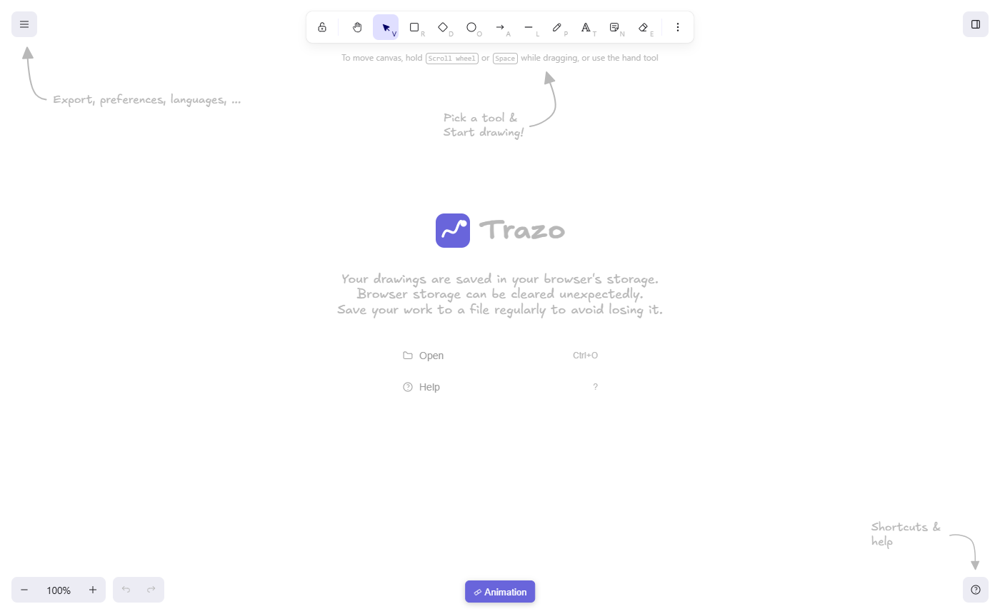
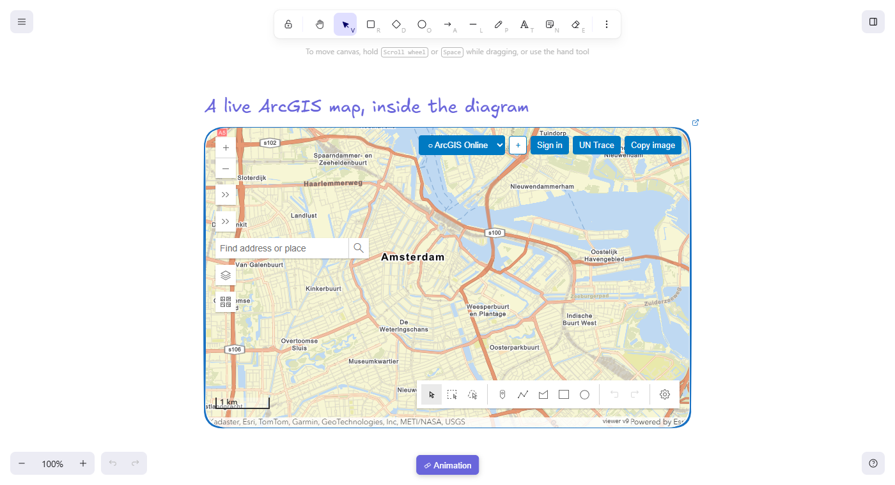
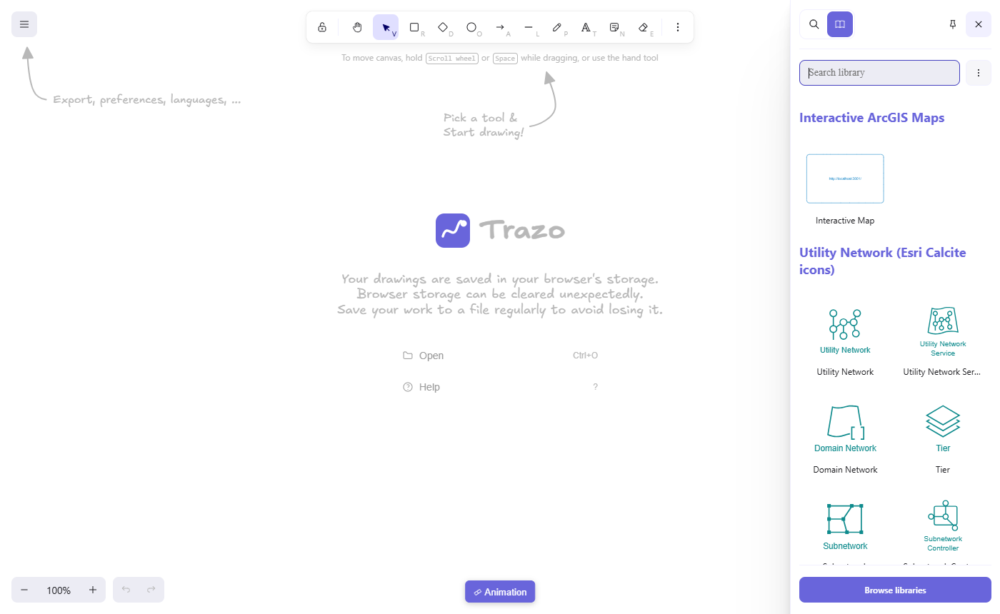
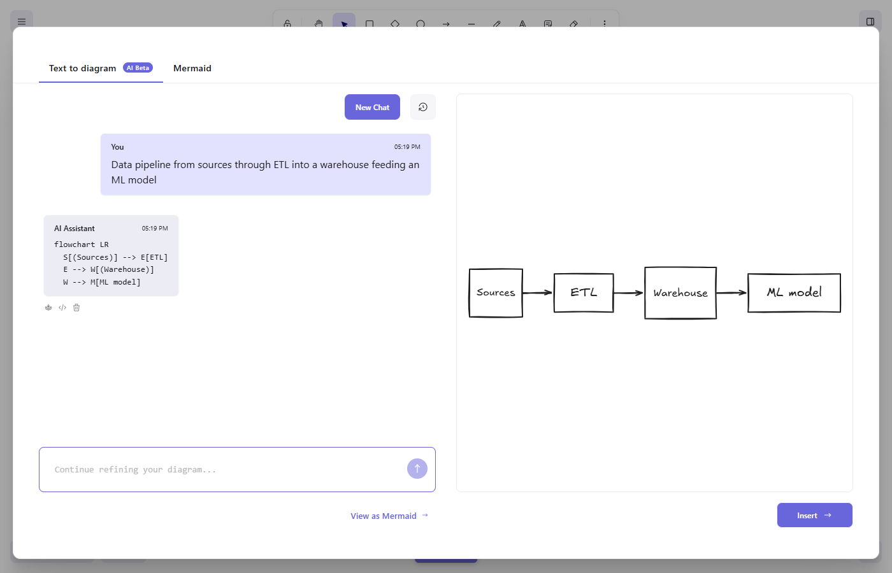
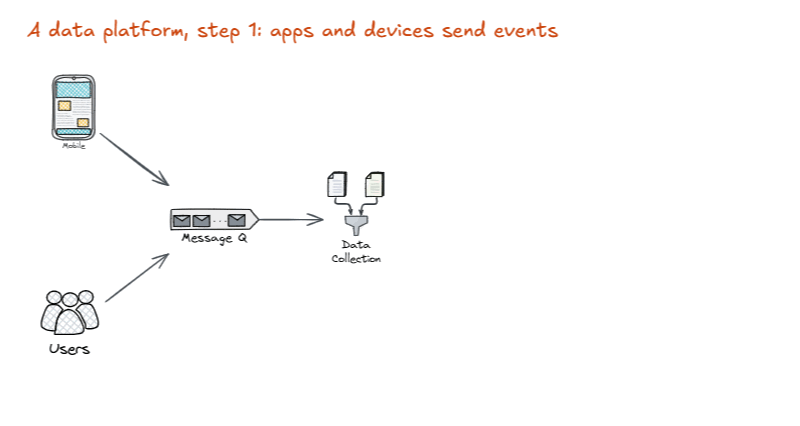

<div align="center">

# Trazo

**A local-first diagram studio for architecture, data engineering, GIS and machine learning.**
Hand-drawn whiteboard · live ArcGIS maps · animated slides → MP4/GIF · bring-your-own LLM · no telemetry.



*Built on [Excalidraw](https://github.com/excalidraw/excalidraw) (MIT). Not affiliated with or endorsed by Excalidraw or Esri.*

[English](#english) · [Español](#español)

</div>

---

## English

### Why Trazo?

Excalidraw is a great hand-drawn whiteboard. Trazo keeps everything that makes it great and adds what technical
teams keep asking for:

| | |
|---|---|
| 🗺️ **Live maps inside the canvas** | Embed interactive ArcGIS maps. Add layers by URL or item ID, browse *My content* / search any portal, open Web Maps, sketch on top. Works with **ArcGIS Online and any number of ArcGIS Enterprise portals** at the same time. Optional Utility Network trace (needs a Web Map with a Utility Network). |
| 🧩 **Architecture-ready library** | 150+ ready-to-use components in English, grouped by source: official **Esri Architecture Center** icons (Enterprise components, data stores, personas…), Utility Network concepts, services & SDKs. |
| 🎞️ **Animated slides** | Frames are slides. Duplicate a slide, change things, and elements **animate between slides** (position, size, colour, opacity…). Preview, present with ← →, and **export MP4 or GIF** — rendered in your browser, nothing uploaded. |
| 🤖 **Bring your own LLM** | "Text to diagram" connects to **your** model — Ollama / LM Studio locally, any OpenAI-compatible server, or Anthropic. Off by default; nothing is sent until you configure it. Output is a Mermaid diagram turned into editable shapes. |
| 🔒 **Local-first & hardened** | No analytics, no Sentry, no CDN, no service worker, no hosted collaboration. Strict Content-Security-Policy, read-only containers, ports bound to `127.0.0.1`. See [docs/SECURITY.md](docs/SECURITY.md) — and verify it yourself. |

<table>
<tr>
<td></td>
<td></td>
</tr>
<tr>
<td></td>
<td></td>
</tr>
</table>

### Quick start

Requirements: **Docker** (with Compose v2) and **Node.js 20+** (only to generate the icon library).

```bash
git clone https://github.com/<you>/<repo>.git && cd <repo>

node tools/build-library.js      # downloads the Calcite glyphs, builds the ArcGIS library
docker compose up -d --build     # first build takes a few minutes

# open http://localhost:3000
```

Stop with `docker compose down`. Everything listens on `127.0.0.1` only.

### What talks to the network?

| When | Contacts | Why |
|---|---|---|
| Opening the app, drawing, saving, animating, exporting | **nothing** | fully local (verified: 0 external hosts, 0 CSP violations, 0 service workers) |
| You use an interactive map | `js.arcgis.com`, Esri basemaps, **the portals you add** | an ArcGIS map needs them |
| You configure an LLM | **the URL you set** (e.g. `http://localhost:11434`) | Text to diagram |
| You click *Browse libraries* | `libraries.excalidraw.com` | optional community libraries (a normal link) |

### Documentation

| | |
|---|---|
| [docs/ARCHITECTURE.md](docs/ARCHITECTURE.md) | How it is built and why |
| [docs/SECURITY.md](docs/SECURITY.md) | Threat model, hardening, how to verify |
| [docs/VIEWER.md](docs/VIEWER.md) | ArcGIS viewer: portals, sign-in, layers, Utility Network |
| [docs/ANIMATION.md](docs/ANIMATION.md) | Slides, transitions, MP4/GIF export |
| [docs/AI.md](docs/AI.md) | Connecting Ollama / LM Studio / OpenAI-compatible / Claude |
| [docs/LIBRARIES.md](docs/LIBRARIES.md) | Icon sources, adding your own libraries, licensing rules |
| [docs/UPDATING.md](docs/UPDATING.md) | Staying in sync with Excalidraw upstream |
| [docs/LOCAL_FIRST_CHANGES.md](docs/LOCAL_FIRST_CHANGES.md) | Everything removed/changed vs. Excalidraw |
| [docs/BRANDING.md](docs/BRANDING.md) | Renaming the project |
| [docs/ROADMAP.md](docs/ROADMAP.md) | What is next, known limits |

### Credits and licenses

- **Excalidraw** — © 2020 Excalidraw, MIT. This project is a derivative work; the upstream license and copyright are kept in [LICENSE](LICENSE) and the full upstream git history is preserved.
- **Esri ArcGIS Architecture Center icons** — © Esri, CC BY 4.0, converted from the official Visio toolkit to SVG.
- **Esri Calcite UI icons** — © Esri, Esri Master License Agreement. **Downloaded at build time, never redistributed here.**
- **ArcGIS Maps SDK for JavaScript** — © Esri, loaded at runtime from Esri's CDN.
- **mp4-muxer**, **gifenc** — MIT (vendored, hashes in [THIRD_PARTY_NOTICES.md](THIRD_PARTY_NOTICES.md)).

Full list: [THIRD_PARTY_NOTICES.md](THIRD_PARTY_NOTICES.md). "Esri" and "ArcGIS" are trademarks of Esri; "Excalidraw" is a trademark of its owners; this project uses them only to describe compatibility.

### Status

Trazo is young. Verified end-to-end with automated browser tests: local-first behaviour, library, map embed, animation + MP4/GIF export, LLM connector (against a mock server), multi-portal UI. **Not yet verified against real private portals** (OAuth/Enterprise sign-in, Utility Network trace) — please report what you find. See [docs/ROADMAP.md](docs/ROADMAP.md).

### Contributing

Issues and PRs welcome — see [CONTRIBUTING.md](CONTRIBUTING.md). Security reports: [SECURITY.md](SECURITY.md).

---

## Español

### ¿Qué es Trazo?

Un estudio de diagramas **local-first** para arquitectura, ingeniería de datos, GIS y ciencia de datos / ML, construido sobre
[Excalidraw](https://github.com/excalidraw/excalidraw) (MIT). Conserva su estilo dibujado a mano y añade:

- 🗺️ **Mapas ArcGIS vivos dentro del lienzo**, con capas por URL o ID, búsqueda en el portal, Web Maps y dibujo encima. Funciona con **ArcGIS Online y varios ArcGIS Enterprise a la vez**; trazado de Utility Network opcional.
- 🧩 **Librería para arquitectura** con más de 150 componentes en inglés agrupados por fuente (íconos oficiales de Esri Architecture Center, Utility Network, servicios y SDK).
- 🎞️ **Diapositivas animadas**: los elementos se animan entre diapositivas; exporta a **MP4 o GIF** sin salir de tu navegador.
- 🤖 **Tu propio LLM** (Ollama, LM Studio, compatible con OpenAI, Claude) para pasar de texto a diagrama. Apagado por defecto.
- 🔒 **Local y endurecido**: sin analítica, sin telemetría, sin CDN, sin colaboración alojada; política de seguridad estricta y contenedores de solo lectura.

### Inicio rápido

```bash
git clone https://github.com/<tu-usuario>/<repo>.git && cd <repo>
node tools/build-library.js       # descarga los glifos Calcite y genera la librería
docker compose up -d --build      # la primera vez tarda unos minutos
# abre http://localhost:3000
```

Requisitos: Docker y Node.js 20+. Todo escucha solo en `127.0.0.1`.

### Privacidad y red

La app, el dibujo, la animación y la exportación **no hacen ninguna conexión externa**. Solo se conecta a Esri y a los portales que añadas cuando usas un mapa,
a la URL de tu LLM si lo configuras, y a `libraries.excalidraw.com` si pulsas *Browse libraries*. Cómo verificarlo: [docs/SECURITY.md](docs/SECURITY.md).

### Créditos y licencias

Excalidraw (MIT, © 2020 Excalidraw) · íconos de Esri Architecture Center (CC BY 4.0, © Esri) · íconos Calcite (licencia de Esri, se descargan al construir y **no** se redistribuyen) ·
ArcGIS Maps SDK (© Esri, se carga en ejecución) · mp4-muxer y gifenc (MIT). Detalle en [THIRD_PARTY_NOTICES.md](THIRD_PARTY_NOTICES.md).
Proyecto independiente, no afiliado ni respaldado por Excalidraw ni por Esri.

### Estado

Joven. Probado de punta a punta con pruebas automáticas de navegador (modo local, librería, mapa, animación y exportación, conector LLM con servidor simulado, interfaz multi-portal).
**Aún sin validar contra portales privados reales** (inicio de sesión Enterprise/OAuth y trazado de Utility Network): se agradecen reportes. Ver [docs/ROADMAP.md](docs/ROADMAP.md).
