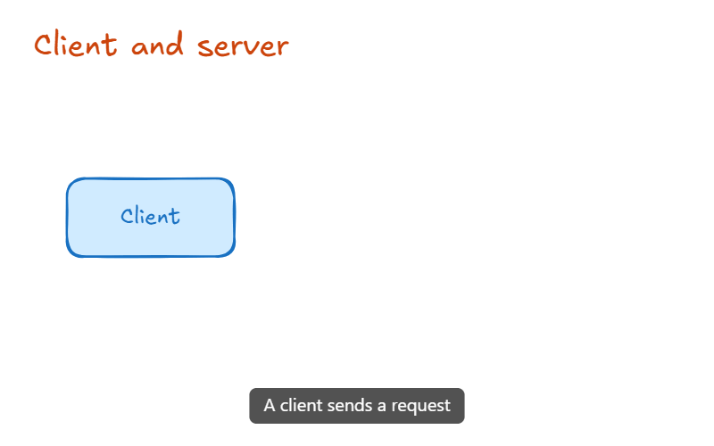

# Animated slides and video export

Open **🎞 Animation** (bottom center of the editor).

1. **Slides are frames.** Press `F` and draw a frame; put your content inside it. Slides are ordered by y position (then x).
2. **Duplicate slide** copies the selected frame (or the last one) _below_ it and links every copy to its original with `customData.animKey`.
3. Change things in the new slide: move, resize, recolour, change opacity or font size, add or delete elements.
4. **▶ Preview** plays the whole animation; **⛶ Present** is manual (`→`/`Space`/click = next, `←` = previous, `Esc` = exit).
5. **Export MP4** (H.264) or **Export GIF**. Settings: transition (ms), default hold (ms), easing, FPS, width. **Per-slide hold:** each row of the slide list has its own _ms_ field (type a value, press Enter). Empty = use the default hold. It is stored in the frame's `customData.holdMs`, so it is saved with the drawing and copied by _Duplicate slide_.

## Transition type per slide

Each slide (except the first) has a selector for **how it is entered** (stored in the frame's `customData.transition`):

| Mode | What happens |
| --- | --- |
| **Smart** (default) | Matching elements move/morph, new ones fade in, removed ones fade out. |
| **Fade** | Nothing moves: the previous slide cross-fades into this one. Elements that did not change stay perfectly still. |
| **Cut** | Instant switch, no transition time. |
| **Build** | Like Smart, but the **new elements appear one after another** (in the order they are in the scene) and **arrows and lines draw themselves**. A group, or a text with its container, appears as one piece. The transition lasts as long as it has things to show (about 0.45 s per piece, at least the default transition time, at most 10 s). |
| **Pan** | The **camera travels over the canvas** from the previous slide to this one, with a zoom out on long trips. Nothing morphs: elements stay where they are on the canvas and only the view moves. Good for slides placed far apart. |

Elements that are **identical in both slides** (same type, place inside the frame, colours, text…) never move or blink, even if they were copy/pasted and have no `animKey`. Only what actually changed is animated.

## Captions

Under each slide in the list there is a **Caption (optional)** field. The text is drawn at the bottom of the video (white on a dark bar, wrapped to up to three lines) in the Preview, in Present mode and in the exported MP4/GIF. Between two slides the old caption fades out and the new one fades in. It is stored in the frame's `customData.caption`, so it is saved with the drawing. Leave some empty room at the bottom of your slides, because the caption is drawn over the picture.

## Easing

The **Easing** setting shapes every transition: _Ease in-out_ (default), _Ease in-out (strong)_, _Ease out_, _Linear_, and two playful ones, _Overshoot_ (goes a little past the end and settles) and _Spring_ (a damped bounce). Colors and opacity are kept in range, so overshooting never breaks the picture.

## How it animates

Elements with the same `animKey` are interpolated in frame-relative coordinates: position, size, angle, opacity, stroke and fill colour, stroke width, font size and the points of lines/arrows (when the point count matches). Elements that exist in only one slide fade out/in (or are revealed in order in _Build_). Slides of different sizes interpolate their size.

Rendering uses Excalidraw's own exporter at the target size (vector re-render, so Preview/Present/exports are sharp at any resolution). Hold frames are rendered once and reused.

## Export details

- **MP4**: browser WebCodecs `VideoEncoder` (H.264, tries High/Main/Baseline) + vendored `mp4-muxer`. Needs a browser with H.264 encoding (Chrome/Edge). Output size = chosen width × proportional height (even numbers).
- **GIF**: vendored `gifenc`, per-frame palette, identical frames merged. Capped at 15 fps / 800 px.
- Nothing leaves your browser. Cancel any time.

## Limits

- Interactive map embeds render as a placeholder (use _Copy image_ in the map).
- Matching is by `animKey`; slides not created with _Duplicate slide_ animate only through elements you link manually (`customData.animKey`).
- _Pan_ renders only the elements of the two slides it travels between, not other things that happen to lie in between on the canvas.
- In _Build_ the order is the order of the elements in the scene (what you drew first appears first); there is no manual ordering yet.
- No audio in exported videos yet. To narrate, record the Preview or Present mode with the [recorder](RECORDER.md); see also [ROADMAP.md](ROADMAP.md).

## Inspiration

Idea of "frames as slides + automatic interpolation" is inspired by _Excalidraw Smart Presentation_ (MIT, https://github.com/excalidraw-smart-presentation). No code was copied: it is a fork of an older Excalidraw base with a fixed 300 ms linear transition and no export, so this module was implemented natively.
