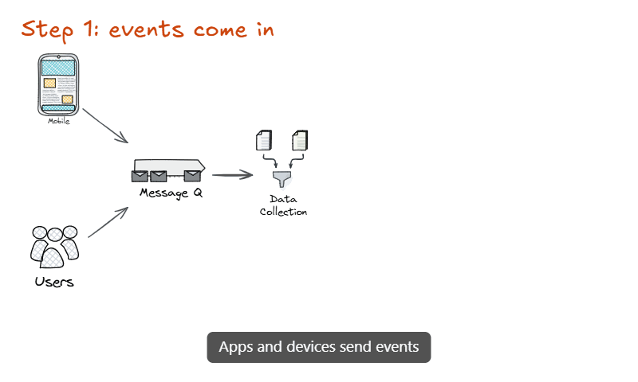

# Animated slides and video export

Open **🎞 Animation** (bottom center of the editor).

1. **Slides are frames.** Press `F` and draw a frame; put your content inside it. Slides are ordered by y position (then x).
2. **Duplicate slide** copies the selected frame (or the last one) _below_ it and links every copy to its original with `customData.animKey`.
3. Change things in the new slide: move, resize, recolour, change opacity or font size, add or delete elements.
4. **▶ Preview** plays the whole animation; **⛶ Present** is manual (`→`/`Space`/click = next, `←` = previous, `Esc` = exit).
5. **Export MP4** (H.264) or **Export GIF**. Settings: transition (ms), default hold (ms), easing, FPS, width. **Per-slide hold:** each row of the slide list has its own _ms_ field (type a value, press Enter). Empty = use the default hold. It is stored in the frame's `customData.holdMs`, so it is saved with the drawing and copied by _Duplicate slide_.

## Transition type per slide

Each slide (except the first) has a selector for **how it is entered** (stored in the frame's `customData.transition`):

| Mode | What happens |
| --- | --- |
| **Smart** (default) | Matching elements move/morph, new ones fade in, removed ones fade out. |
| **Fade** | Nothing moves: the previous slide cross-fades into this one. Elements that did not change stay perfectly still. |
| **Cut** | Instant switch, no transition time. |
| **Build** | Like Smart, but the **new elements appear one after another** (in the order they are in the scene) and **arrows and lines draw themselves**. A group, or a text with its container, appears as one piece. The transition lasts as long as it has things to show (about 0.45 s per piece, at least the default transition time, at most 10 s). |
| **Pan** | The **camera travels over the canvas** from the previous slide to this one, with a zoom out on long trips. Nothing morphs: elements stay where they are on the canvas and only the view moves. Good for slides placed far apart. |

Elements that are **identical in both slides** (same type, place inside the frame, colours, text…) never move or blink, even if they were copy/pasted and have no `animKey`. Only what actually changed is animated.

## Captions

Under each slide in the list there is a **Caption (optional)** field. The text is drawn at the bottom of the video (white on a dark bar, wrapped to up to three lines) in the Preview, in Present mode and in the exported MP4/GIF. Between two slides the old caption fades out and the new one fades in. It is stored in the frame's `customData.caption`, so it is saved with the drawing. Leave some empty room at the bottom of your slides, because the caption is drawn over the picture.

## Narration (your voice, in sync with the animation)

Record your voice while you present, and the MP4 comes out with it, perfectly in step with the picture.

1. Press **🎙 Narrate** (or the 🎙 next to a slide to start from that slide). The browser asks for the microphone, and after a 3 second countdown the recording starts.
2. **Talk while the slide builds, and press `→` (or `Space`, or click) when you want the next slide.** The transition into the next slide starts at that moment. `Esc`, the ✕, or `→` on the last slide finish and save. The bar at the bottom shows the time, the slide and your microphone level.
3. Each slide now has its own clip (the length appears next to it, with ✕ to delete it). Re-record any slide by pressing the 🎙 next to it: it records that slide and the ones after it.
4. **Preview** plays the animation with your voice, and **Export MP4** includes it. Untick **Use my narration** to go back to the plain timing.

Why it stays in sync: the voice is captured as raw samples and counted, and every "next" is a position in that count, not a guess of when a recorder started. Each clip begins where the transition into its slide begins. A slide then lasts at least as long as its clip plus 0.4 s of silence, so the length of every slide follows what you said and the voice can never drift or overlap the next slide. A clip never makes a slide shorter than its normal hold.

Details and limits:

- The MP4 audio is mono, AAC (or Opus when the browser has no AAC encoder), 128 kbps. A **GIF has no sound**, so it ignores the narration and keeps the plain timing.
- The clips are stored **in this browser** (IndexedDB), tied to the slide. Nothing is uploaded. To take them with the drawing, use **Save drawing with narration** (below).
- The microphone is chosen in the list under the buttons (it remembers your choice on this device; if it is unplugged, the system default is used).
- A recording only moves forward (no going back). A slide you pass in under 0.3 s keeps the narration it had.
- It needs a browser with WebCodecs audio encoding for the MP4 (Chrome or Edge). If the browser cannot encode audio you get a clear message and can untick the narration.
- Noise suppression, echo cancellation and automatic gain are on; use headphones if your speakers are playing.

### Narration inside the drawing file

**Save drawing with narration** downloads a normal `.excalidraw` file that also carries the narration of every slide, in one extra field (`trazoNarration`) that Excalidraw ignores, so the file still opens anywhere. **Open drawing with narration…** replaces the canvas with such a file (you can undo it) and puts the clips back, matched to the slides by their id. The audio is the same 16-bit mono WAV the app keeps, compressed with gzip when the browser can: about 5 MB per minute of speech, so a long narration makes a big file. Saving the drawing the usual way (Ctrl+S, or the Excalidraw menu) does not include narration, because Excalidraw does not know about it.

## Easing

The **Easing** setting shapes every transition: _Ease in-out_ (default), _Ease in-out (strong)_, _Ease out_, _Linear_, and two playful ones, _Overshoot_ (goes a little past the end and settles) and _Spring_ (a damped bounce). Colors and opacity are kept in range, so overshooting never breaks the picture.

## How it animates

Elements with the same `animKey` are interpolated in frame-relative coordinates: position, size, angle, opacity, stroke and fill colour, stroke width, font size and the points of lines/arrows (when the point count matches). Elements that exist in only one slide fade out/in (or are revealed in order in _Build_). Slides of different sizes interpolate their size.

Rendering uses Excalidraw's own exporter at the target size (vector re-render, so Preview/Present/exports are sharp at any resolution). Hold frames are rendered once and reused.

## Export details

- **MP4**: browser WebCodecs `VideoEncoder` (H.264, tries High/Main/Baseline) + vendored `mp4-muxer`. Needs a browser with H.264 encoding (Chrome/Edge). Output size = chosen width × proportional height (even numbers).
- **GIF**: vendored `gifenc`, per-frame palette, identical frames merged. Capped at 15 fps / 800 px.
- Nothing leaves your browser. Cancel any time.

## Limits

- Interactive map embeds render as a placeholder (use _Copy image_ in the map).
- Matching is by `animKey`; slides not created with _Duplicate slide_ animate only through elements you link manually (`customData.animKey`).
- _Pan_ renders only the elements of the two slides it travels between, not other things that happen to lie in between on the canvas.
- In _Build_ the order is the order of the elements in the scene (what you drew first appears first); there is no manual ordering yet.
- No audio in exported videos yet. To narrate, record the Preview or Present mode with the [recorder](RECORDER.md); see also [ROADMAP.md](ROADMAP.md).

## Inspiration

Idea of "frames as slides + automatic interpolation" is inspired by _Excalidraw Smart Presentation_ (MIT, https://github.com/excalidraw-smart-presentation). No code was copied: it is a fork of an older Excalidraw base with a fixed 300 ms linear transition and no export, so this module was implemented natively.
