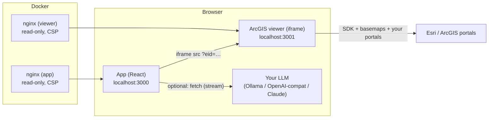

# Architecture

Trazo is a **derivative of Excalidraw** (MIT). The repository root is the upstream monorepo with additive
modules and a small number of surgical patches, so upstream updates remain mergeable ([UPDATING.md](UPDATING.md)).

## 1. Runtime



Two containers, both plain nginx serving static files (plus one optional pass-through in the app's nginx, `/llm/ollama-cloud/` → `ollama.com`, used only by the Ollama Cloud AI preset). There is **no backend**: no database, no API, no collaboration
server. All state lives in the browser.

## 2. Repository map

| Path | What | Origin |
|---|---|---|
| `packages/`, `excalidraw-app/` | the editor and the web app | upstream (patched, see below) |
| `excalidraw-app/animation/` | slides → smart-animate → MP4/GIF | **new** |
| `excalidraw-app/ai/`, `components/AI.tsx` | opt-in LLM connector | **new** |
| `excalidraw-app/branding.ts`, `components/BrandDialogs.tsx` | identity, About, AI settings | **new** |
| `viewer/` | ArcGIS Maps SDK viewer (standalone page, served on :3001) | **new** |
| `tools/` | icon conversion, library builder, Calcite fetch, network audit | **new** |
| `assets/esri-icons/` | official Esri icons converted to SVG (CC BY 4.0) | **new** |
| `deploy/nginx/` | hardened nginx configs | **new** |
| `scripts/csp-hashes.mjs` | build-time CSP generation | **new** (in upstream's `scripts/` because the Docker context only includes that folder) |
| `public/vendor/` | vendored mp4-muxer and gifenc | **new** |
| `public/arcgis.excalidrawlib` | generated library (git-ignored) | generated |

Patches to upstream files are listed in [LOCAL_FIRST_CHANGES.md](LOCAL_FIRST_CHANGES.md).

## 3. Key design decisions

**Library grouping by id prefix.** Items shipped by this project have ids `arcgis:<slug>` and names
`<Source · Category> / <Name>`. `LibraryMenuItems.tsx` renders those in their own sections above the user's
personal/community libraries, so sources never mix. On every load `App.tsx` *replaces* items with the `arcgis:` prefix
and purges known legacy copies, without touching other libraries.

**Images in library items.** Excalidraw library items hold elements only, not image files. The library JSON has a
top-level `files` map; the app registers them (`excalidrawAPI.addFiles`) and exposes them to the thumbnail renderer
(`window.__arcgisLibraryFiles`, read by `useLibraryItemSvg.ts`).

**ArcGIS embeds.** `packages/element/src/embeddable.ts` recognises ArcGIS item/service URLs (any host:
`/home/item.html?id=`, `/sharing/rest/content/items/`, `…/FeatureServer/0`, …) and rewrites them to the viewer
(`?portal=&item=` or `?layers=`). Pasting such a URL on the canvas creates the embed. `App.tsx` appends
`eid=<element id>` so every embed has its own saved state (layers, sketches) in `localStorage`.

**Viewer.** One static page (`viewer/index.html` + `viewer.js`). Multi-portal: a list of portals (ArcGIS Online +
Enterprise) and one credential per portal (the SDK's `IdentityManager`, persisted to `localStorage` because the SDK
keeps them in memory only). Layers remember their portal (`"<portal>||<itemId>"`).

**Animation.** Frames are slides, ordered by y then x. Elements are matched across slides by
`customData.animKey` (set by *Duplicate slide*), then interpolated in frame-relative coordinates and rendered with
Excalidraw's own `exportToCanvas` (vector re-render at the target size, so it stays sharp). MP4 uses WebCodecs +
vendored `mp4-muxer`; GIF uses vendored `gifenc`. Everything runs in the browser.

**Local-first.** See [SECURITY.md](SECURITY.md). Hosted-service integrations are removed rather than disabled by a flag,
so they cannot be re-enabled by accident.

## 4. Build pipeline

```
node tools/build-library.js     # (1) fetch Calcite glyphs  (2) read assets/esri-icons  (3) write public/arcgis.excalidrawlib
docker compose build            # yarn install → vite build → scripts/csp-hashes.mjs → nginx image
```

`Dockerfile` (upstream's, extended): after the Vite build it computes the sha256 of the inline scripts in the built
`index.html` and writes `csp.inc`, copied into the nginx image.

## 5. Testing

There is no committed browser test suite yet (see [ROADMAP.md](ROADMAP.md)). During development the behaviour was
verified with scripted headless-Chrome checks (library, embeds, animation + export, LLM mock, multi-portal UI,
network audit). `tools/audit/network-audit.cjs` is the one shipped: run it after every change that may add requests.
Upstream's unit tests still run with `yarn test`.
