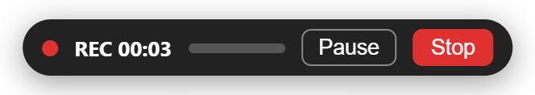

# Recorder

**⏺ Record** (next to the Animation button) records the canvas, or the whole app, together with your microphone, so you can draw and explain at the same time. The video is made in your browser and **never leaves it**.

## How to use it

1. Press **⏺ Record**, choose **What to record** and the options, and press **Start**. If you chose a mode that needs it, the browser asks which tab to share (choose this tab). A 3 second countdown then gives you time to get ready.
2. Draw, move, zoom, change slides and talk. A small bar at the bottom shows the time and your microphone level, with **Pause** and **Stop**.
3. When you stop, a preview opens. **Download** saves the file (`trazo-recording-YYYY-MM-DD-HHMM.mp4`), **Discard** throws it away, **Record again** starts over.

## What to record

| Mode | What is in the video | Permission |
| --- | --- | --- |
| **Canvas only** (default) | Just the canvas: no toolbars, panels, countdown, recording bar, other windows or notifications. The sharpest. Maps and embedded pages show only the outline of their box. | none (microphone only) |
| **Canvas and embedded pages (maps)** | The same, plus the **live image of maps and embedded pages**. The toolbars are still left out. | share this tab |
| **Whole app** | This tab exactly as you see it: menus, panels, toolbars and maps. The recording bar is part of the video unless you tick **Hide the recording bar** (then stop with **Alt+Shift+R**). | share this tab |

Why a permission for the map modes: a map is a web page inside the canvas, and the browser does not let one page read the pixels of another. The only allowed way is to capture the tab with the browser's own share dialog. The recorder then copies only the map rectangles from it (mode 2) or records the tab as is (mode 3).

Only **this browser tab** is accepted. If you pick a window or a whole screen, the recorder refuses, so other apps and private content never end up in a video by mistake.

Common to all modes:

- A highlight that follows your pointer, with a ripple on every click (option).
- Selection boxes and handles in the canvas modes only if you tick **Show selection boxes and handles**.
- Your microphone with echo cancellation and noise suppression (option). Pick which one in the list under the checkbox; the choice is remembered on this device, and if that microphone is unplugged the system default is used. Unticking the checkbox gives a silent video.

## Quality

| Option | Result |
| --- | --- |
| **Native** (default) | same pixel size as the canvas, no scaling, the sharpest. Use a big window or full screen for a bigger video, up to 4K. |
| 1080p / 720p | scaled to that height keeping the aspect ratio. A canvas smaller than 1080p is only stretched, not sharper. 720p gives smaller files. |

In **Whole app** mode the size is the tab's own size (up to 4K), so the quality options are disabled. The picture can never be sharper than your screen: the canvas is recorded at the pixels it really has on screen.

Video is MP4 (H.264 + AAC) when the browser can encode it, otherwise WebM (VP9 or VP8 + Opus). Frame rate is 30 fps and the bit rate follows the video size (about 6 Mbps at 1080p).

## Privacy and security

- Nothing is uploaded. The recording is a file in memory until you download it.
- The browser asks for the microphone, and for the tab in the map modes, only when you press Start. The app's `Permissions-Policy` header allows the microphone for the app itself (`microphone=(self)`); embedded pages such as the map viewer cannot use it, and the viewer's own policy still blocks it.
- If you block the microphone, untick **Record microphone** to record without sound.
- If you stop sharing with the browser's own "Stop sharing" button, the recording ends and is kept.

## Limits

- Keep the tab visible: browsers pause drawing in background tabs, which freezes the video.
- In **Canvas and embedded pages**, anything that covers a map (a panel, the toolbar) also covers it in the video, because the map is copied from the real tab. Keep the map uncovered.
- Resizing the window while recording a map mode can misalign the maps, so keep the window size fixed.
- The system cursor shape is not recorded, the highlight is drawn instead. The laser pointer trail (a separate layer) is not captured in the canvas modes.
- The recording is built in memory until you download it, so very long recordings at high quality use a lot of RAM. Record long sessions in parts.
- Files written by the browser's recorder are fragmented. If a player has trouble seeking in one, saving a copy without re-encoding in a video tool rebuilds the index.
- Tested in Chrome: MP4 with H.264 and AAC, microphone, pause, and all three modes (the tab modes in a Chrome window with its tab auto-selected). Other browsers fall back to WebM or to their own supported format and have not been tested. In Chrome, tab capture also prints a harmless "camera is not allowed in this document" message in the console.

## Where the code is

`excalidraw-app/recorder/recorder.ts` (recording and pure helpers, unit tested in `recorder.test.ts`) and `excalidraw-app/components/RecorderPanel.tsx` (the interface).
