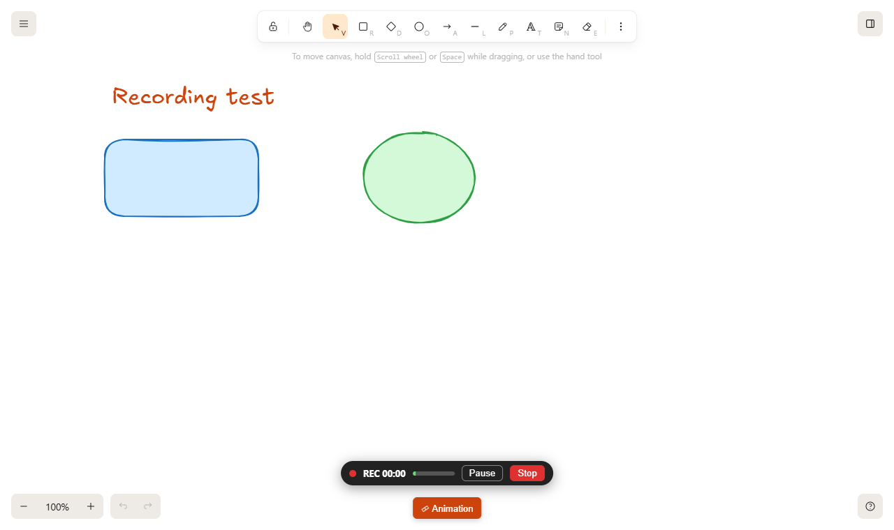

# Canvas recorder

**⏺ Record** (next to the Animation button) records **the canvas, not the screen**, together with your microphone, so you can draw and explain at the same time. The video is made in your browser and **never leaves it**.

## How to use it

1. Press **⏺ Record**, choose the options and press **Start**. A 3 second countdown gives you time to get ready.
2. Draw, move, zoom, change slides and talk. A small bar at the top shows the time and your microphone level, with **Pause** and **Stop**.
3. When you stop, a preview opens. **Download** saves the file (`trazo-recording-YYYY-MM-DD-HHMM.mp4`), **Discard** throws it away, **Record again** starts over.

## What ends up in the video

- Only the canvas: the toolbars, panels, the countdown, the recording bar and your other windows and notifications are not in it.
- A highlight that follows your pointer, with a ripple on every click (option).
- Selection boxes and handles only if you tick **Show selection boxes and handles**.
- Your microphone with echo cancellation and noise suppression (option). Unticking it gives a silent video.

## Quality

| Option | Result |
| --- | --- |
| **Native** (default) | same pixel size as the canvas, no scaling, the sharpest. Use a big window or full screen for a bigger video. |
| 1080p / 720p | scaled to that height keeping the aspect ratio. 720p gives smaller files. |

Video is MP4 (H.264 + AAC) when the browser can encode it, otherwise WebM (VP9 or VP8 + Opus). Frame rate is 30 fps and the bit rate follows the video size (about 6 Mbps at 1080p).

## Privacy and security

- Nothing is uploaded. The recording is a file in memory until you download it.
- The browser asks for the microphone the first time and only when you press Start. The app's `Permissions-Policy` header allows it for the app itself (`microphone=(self)`); embedded pages such as the map viewer cannot use it, and the viewer's own policy still blocks it.
- If you block the microphone, untick **Record microphone** to record without sound.

## Limits

- Keep the tab visible: browsers pause drawing in background tabs, which freezes the video.
- The system cursor shape is not recorded, the highlight is drawn instead. The laser pointer trail (a separate layer) is not captured.
- Interactive map embeds are iframes on top of the canvas, not part of it, so they cannot be copied into the video (only the outline of its box appears). Use the system's screen recorder for the map.
- The recording is built in memory until you download it, so very long recordings at high quality use a lot of RAM. Record long sessions in parts.
- Files written by the browser's recorder are fragmented. If a player has trouble seeking in one, saving a copy without re-encoding in a video tool rebuilds the index.
- Tested in Chrome (MP4 with H.264 and AAC). Other browsers fall back to WebM or to their own supported format and have not been tested.

## Where the code is

`excalidraw-app/recorder/recorder.ts` (recording and pure helpers, unit tested in `recorder.test.ts`) and `excalidraw-app/components/RecorderPanel.tsx` (the interface).
